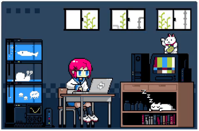

<h1>
  Maria Clara Reginato
</h1>

<strong>Desenvolvedora de Sistemas em formação, com foco em Frontend <strong> | 

 Criadora de interfaces intuitivas, interativas, acessíveis e atraentes. 
Sempre explorando novas tecnologias e soluções criativas. Cultivando criatividade através da natação, das artes em geral e da Fórmula 1 — hobbies que trazem equilíbrio, foco e um olhar sensível para soluções inovadoras.

 
 

<strong>Systems Developer in training, focused on Frontend<strong> | 

 
Creator of intuitive, interactive, accessible, and attractive interfaces.
Always exploring new technologies and creative solutions.
Cultivating creativity through swimming, the arts in general, and Formula 1 — hobbies that bring balance, focus, and a keen eye for innovative solutions.

##
 

  

 

  
  
  
  
  
  
  
  
  

##

<table width="100%">
  <tr>
    <td align="center" width="50%">
       
      
       
      
       
    </td>
    <td align="right" width="50%">
      
       
      
       
      
    </td>
  </tr>
</table>
</tr>

##

<picture align="center">
  <source media="(prefers-color-scheme: dark)" srcset="https://raw.githubusercontent.com/mariaclarareginato/mariaclarareginato/output/github-contribution-grid-snake-dark.svg">
  <source media="(prefers-color-scheme: light)" srcset="https://raw.githubusercontent.com/mariaclararereginato/mariaclarareginato/output/github-contribution-grid-snake-dark.svg">
  
</picture>

